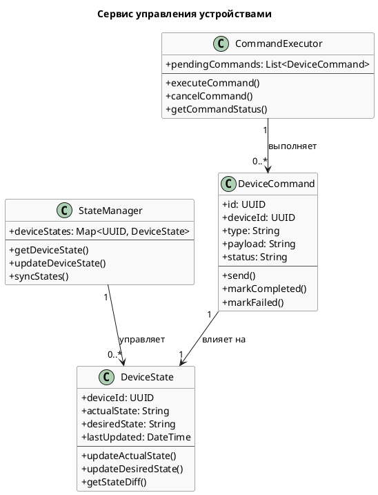
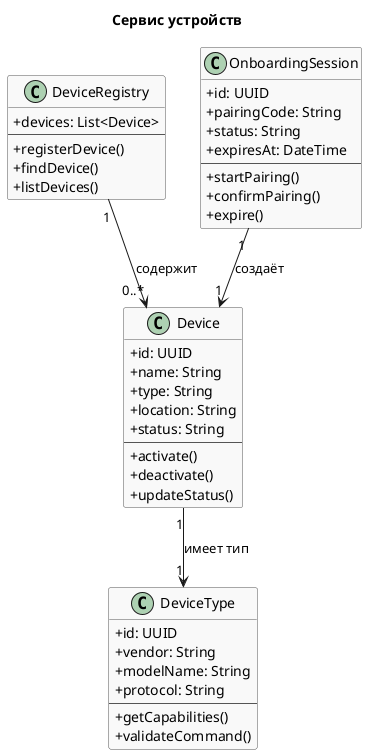

```puml

```


```puml
@startuml
title Сервис управления устройствами

skinparam classAttributeIconSize 0
skinparam class {
  BackgroundColor #F9F9F9
  BorderColor #555555
}

class DeviceCommand {
  +id: UUID
  +deviceId: UUID
  +type: String
  +payload: String
  +status: String
  --
  +send()
  +markCompleted()
  +markFailed()
}

class DeviceState {
  +deviceId: UUID
  +actualState: String
  +desiredState: String
  +lastUpdated: DateTime
  --
  +updateActualState()
  +updateDesiredState()
  +getStateDiff()
}

class CommandExecutor {
  +pendingCommands: List<DeviceCommand>
  --
  +executeCommand()
  +cancelCommand()
  +getCommandStatus()
}

class StateManager {
  +deviceStates: Map<UUID, DeviceState>
  --
  +getDeviceState()
  +updateDeviceState()
  +syncStates()
}

DeviceCommand "1" --> "1" DeviceState : влияет на
CommandExecutor "1" --> "0..*" DeviceCommand : выполняет
StateManager "1" --> "0..*" DeviceState : управляет

@enduml

```

```puml
@startuml
title Сервис устройств

skinparam classAttributeIconSize 0
skinparam class {
  BackgroundColor #F9F9F9
  BorderColor #555555
}

class Device {
  +id: UUID
  +name: String
  +type: String
  +location: String
  +status: String
  --
  +activate()
  +deactivate()
  +updateStatus()
}

class DeviceType {
  +id: UUID
  +vendor: String
  +modelName: String
  +protocol: String
  --
  +getCapabilities()
  +validateCommand()
}

class DeviceRegistry {
  +devices: List<Device>
  --
  +registerDevice()
  +findDevice()
  +listDevices()
}

class OnboardingSession {
  +id: UUID
  +pairingCode: String
  +status: String
  +expiresAt: DateTime
  --
  +startPairing()
  +confirmPairing()
  +expire()
}

Device "1" --> "1" DeviceType : имеет тип
DeviceRegistry "1" --> "0..*" Device : содержит
OnboardingSession "1" --> "1" Device : создаёт
@enduml

```